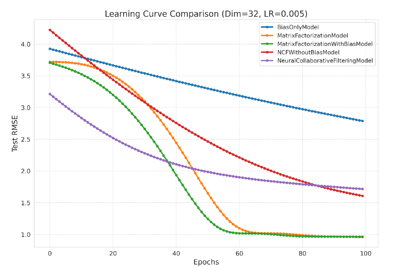
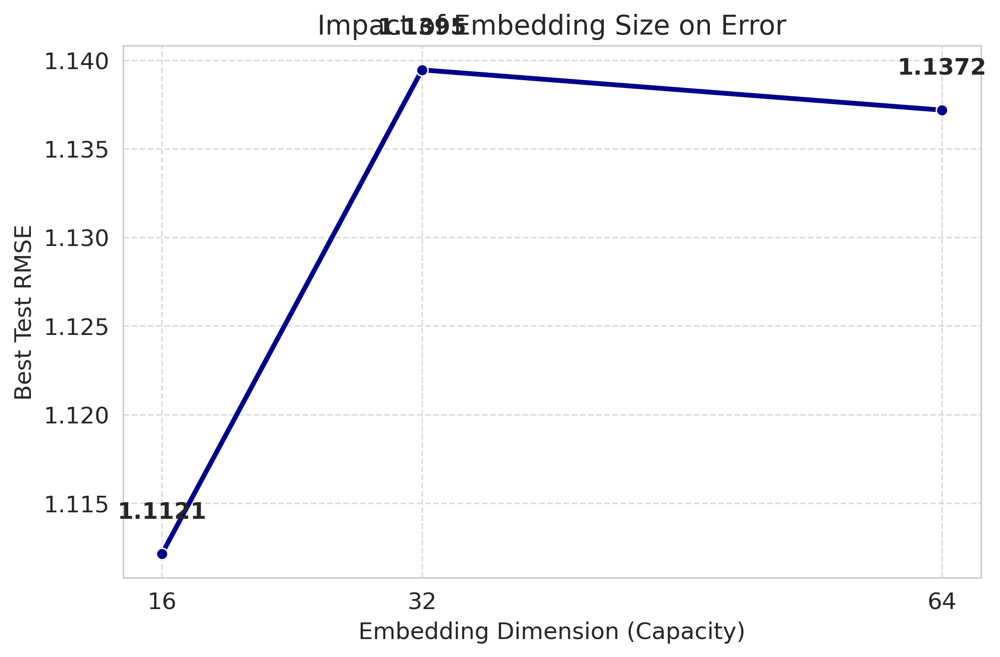

# Recommender Systems

This repository contains my graduate-level coursework and independent experiments focused on building, optimizing, and evaluating recommendation algorithms. The projects range from Deep Learning-based Collaborative Filtering using PyTorch to Content-Based systems leveraging NLP on massive unstructured datasets.

## Tech Stack & Skills
* **Core:** Python, PyTorch (GPU), Scikit-learn, Pandas, NumPy
* **Techniques:** Matrix Factorization, Neural Collaborative Filtering (NCF), TF-IDF, Cosine Similarity, Grid Search
* **Optimization:** AdamW, ReduceLROnPlateau, Early Stopping, Gradient Descent
* **Engineering:** GPU Acceleration, Pre-loaded GPU Tensors, Parquet Checkpointing
* **Environment:** Google Colab Pro (High-RAM & GPU Runtime)

---

## `ml-100k-parameter-optimizer`: Optimized Collaborative Filtering & NCF
**Dataset:** [MovieLens 100K](https://grouplens.org/datasets/movielens/100k/)

### Implementation Details
This project benchmarks five distinct model architectures to minimize prediction error (RMSE) on sparse user-item interaction data.

* **Architecture:** Models were implemented in PyTorch. To maximize training speed, the entire dataset was converted to tensors and loaded directly onto the GPU to eliminate data transfer overhead.
* **Optimization:** Training utilized the **AdamW** optimizer (to decouple weight decay) and a **ReduceLROnPlateau** scheduler (halving the learning rate after 2 epochs of stagnation).
* **Grid Search:** An extensive search was performed across 125 combinations of embedding dimensions (8-128), learning rates, and regularization strengths.
* **Hardware:** Executed on **Google Colab Pro** to support intensive grid search iterations and GPU-resident training.

### Results
Models were evaluated using 5-Fold Cross-Validation. The optimal configuration was found to be `Embedding Dim=32`, `LR=0.005`, and `Reg=1e-06`.

| Model Architecture | Test RMSE |
| :--- | :---: |
| **Matrix Factorization (w/ Bias)** | **0.9602** |
| Matrix Factorization (No Bias) | 0.9640 |
| Neural Collaborative Filtering | 1.7150 |
| NCF (No Bias) | 1.6069 |
| Bias Only Baseline | 2.7879 |

*Finding:* The Matrix Factorization with Bias model achieved the lowest RMSE and fastest convergence, significantly outperforming the Neural Network (NCF) architectures on this specific dataset.

*Figure 1: Validation RMSE over 100 epochs. The Matrix Factorization model (Green) converges faster than Neural Network architectures.*

*Figure 2: Impact of embedding size on error. Performance degrades at dimensions higher than 32, indicating overfitting.*

---

## `genome-2021-movie-recommender`: Content-Based Recommender System (NLP)
**Dataset:** [MovieLens Tag Genome 2021](https://grouplens.org/datasets/movielens/tag-genome-2021/)

### Implementation Details
The objective was to predict user ratings by analyzing textual content from over 2.6 million raw movie reviews.

* **Data Pipeline:** Raw reviews were aggregated by movie and cleaned (punctuation removal, stop words). The processed data was saved to a Parquet file checkpoint to bypass processing times on repeated runs.
* **Memory Management:** Due to the dataset size (52,000+ movies), standard similarity matrix calculations caused memory overflows. An "on-the-fly" calculation method was implemented to compute similarity scores only for necessary target pairs during the prediction loop.
* **Hardware:** **Google Colab Pro** High-RAM runtime was required to handle the large-scale text data processing.

### Models Implemented
1.  **TF-IDF + Cosine Similarity:** Weighs words by importance/frequency.
2.  **Binary Counts + Jaccard Similarity:** Weighs words by simple presence/overlap.

### Results
Models were evaluated on a sample of 5,000 ratings using Mean Absolute Error (MAE) and Hit Ratio.

| Model Strategy | MAE | RMSE | Hit Ratio (@10) |
| :--- | :---: | :---: | :---: |
| **Binary + Jaccard** | **0.7593** | **0.9850** | N/A |
| TF-IDF + Cosine | 0.7607 | 0.9855 | 0.20% |
| Global Average Baseline | 0.8355 | 1.0545 | - |
| Random Baseline | 1.5861 | 1.9565 | - |

*Finding:* The Binary + Jaccard model yielded the lowest error, suggesting that simple word presence was a more effective signal than term frequency for this specific review dataset.
